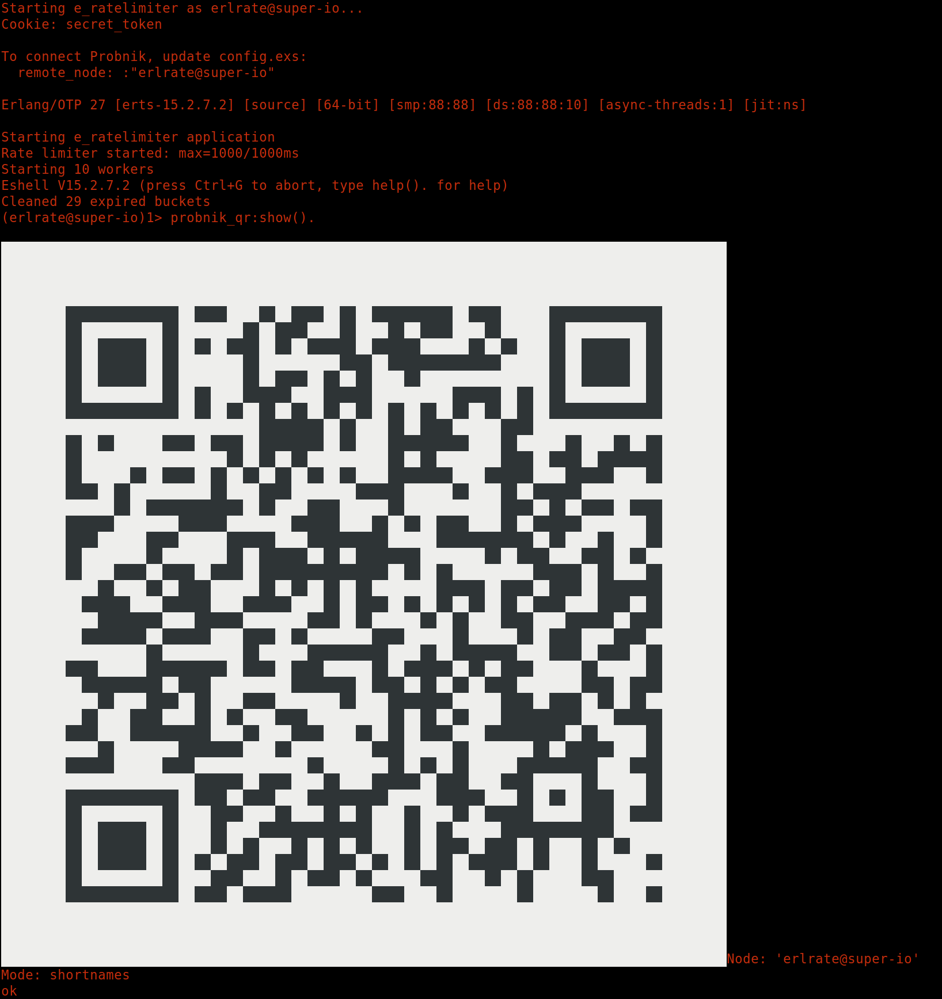
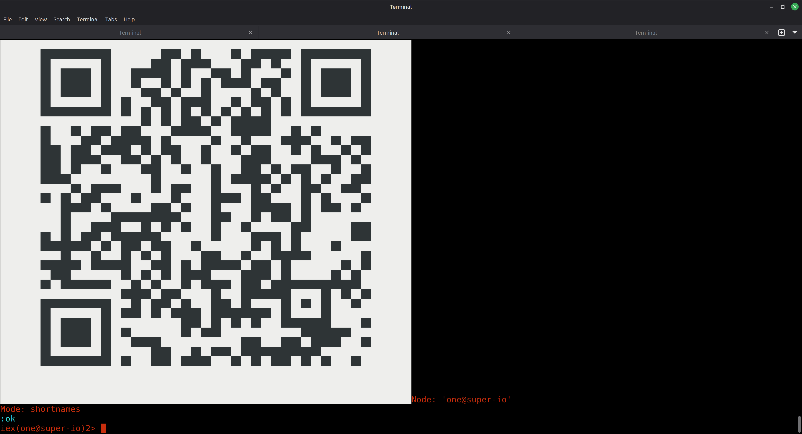

# ProbnikQR

Probnik is a promise: the BEAM node is alive, observable, and worth watching.
It answers the old complaint that visibility is an afterthought, and it turns
BEAM node runtime behavior into something you can actually hold in your
attention. That is the value proposition: see the system, not just the logs.


ProbnikQR exists to make the on-ramp vanish. It is not a product, not a ceremony,
not even a feature you should remember. It is the small, frictionless ritual that
lets you pair a remote node in seconds, then immediately forget it is there.

This library is here to be unseen. It should disappear into the dependency graph
and into muscle memory: start a BEAM node, print a QR, scan it, and step
out for a cigarette while the system tells you the truth. It is a motor skill,
not a tutorial.

## What it does

- Builds pairing payloads for both Probnik remote rendering (TCP) and distributed Erlang.
- Renders an ANSI ASCII QR directly in your terminal.
- Exposes a minimal API in both Erlang and Elixir.

The QR encodes one of these Erlang terms:

```
{probnikoff_net, {{192, 168, 0, 249}, 4040}}
{probnik_pair, 'myapp@localhost', secret, [{mode, shortnames}]}
```

## Documentation (Hex.pm)

This project is set up for ExDoc so Hex.pm can render the docs directly from
the README and moduledoc:

```
mix deps.get
mix docs
```

Changelog: `CHANGELOG.md`

## Why it exists

Because pairing should not be a project. Because opening a remote shell on a
BEAM node should feel like opening a door, not building a stairway. Because
the best tooling is the kind you stop noticing once it works.

ProbnikQR is a small part of the value chain:

1) Start your app.
2) Print the QR.
3) Scan with the mobile app.
4) Walk away, observe, think.

No tabs. No API keys. No paperwork. Just a live system, made legible.

## Dependencies

For now, the library pulls the QR encoder via a git dependency on
`https://github.com/komone/qrcode`.

### Mix (Elixir)

```elixir
def deps do
  [
      {:probnik_qr, git: "git@github.com:borodark/probnik_qr.git" , tag: "I"}
  ]
end
```

The dependency uses a custom compile command because `qrcode` does not ship
with a Mix or Rebar config. This is already set in `mix.exs`.

### Rebar3 (Erlang)

```erlang
{deps, [
    {probnik_qr, {git, "https://github.com/borodark/probnik_qr.git", {branch, "main"}}}
]}.
```

## Usage

Start your app and call `show/0`:

### Elixir

```
iex> ProbnikQR.show()
```

### Erlang

```
1> probnik_qr:show().
```

For distributed Erlang pairing (old format), call `show_pair/0`:

### Elixir

```
iex> ProbnikQR.show_pair()
```

### Erlang

```
1> probnik_qr:show_pair().
```

### Payload helpers

If you want the raw payload (for custom QR rendering):

### Elixir

```
iex> ProbnikQR.payload_net()
{probnikoff_net, {{192, 168, 0, 249}, 4040}}

iex> ProbnikQR.payload_pair()
{probnik_pair, 'myapp@localhost', secret, [{mode, shortnames}]}
```

### Erlang

```
1> probnik_qr:payload_net().
{probnikoff_net, {{192, 168, 0, 249}, 4040}}

2> probnik_qr:payload_pair().
{probnik_pair, 'myapp@localhost', secret, [{mode, shortnames}]}
```

## The ergonomics of it

Use the tool once or twice and it becomes automatic: you stop thinking about QR
codes as objects and start thinking of them as verbs. Pairing becomes a quick
gesture, not a decision. That is the entire point of this library.

## PS: Technical manual (examples)

### Erlang example (e_ratelimiter)

1) Start your app:

```
cd ../e_ratelimiter
./start.sh
```

2) In the Erlang shell, print the QR:

```
probnik_qr:show().
```





### Elixir example (rate-limiter)

1) Start your app:

```
cd ../rate-limiter
iex --sname one@super-io --cookie secret_token -S mix phx.server
```

2) In the IEx shell, print the QR:

```
ProbnikQR.show()
```




## Net payload configuration

By default, ProbnikQR encodes your first non-loopback IPv4 address and port 4040
for `probnikoff_net`. Override with environment variables:

```
PROBNIKOFF_NET_HOST=192.168.0.249
PROBNIKOFF_NET_PORT=4040
```

If `PROBNIKOFF_NET_HOST` is a hostname, the payload will be:

```
{probnikoff_net, {'scenic-server.local', 4040}}
```

## API shortcuts

- `ProbnikQR.show()` / `probnik_qr:show()` defaults to `probnikoff_net`.
- `ProbnikQR.show_net()` / `probnik_qr:show_net()` for TCP rendering.
- `ProbnikQR.show_pair()` / `probnik_qr:show_pair()` for distributed Erlang.
